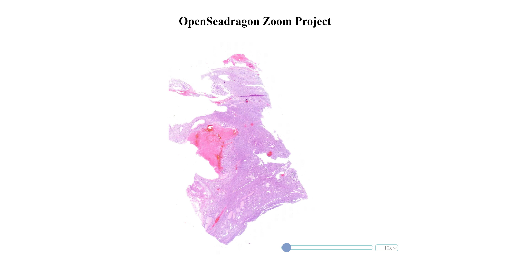

# OpenSeadragon Zoom

This project is a challenge to create a zoom coordinate overlay that doesn't obstruct the image and displays a more useful zoom coordinate that is more akin to a microscope's zoom levels rather than the actual image zoom percentage.

This image shows a detailed stain at 10x zoom out of fullscreen.

This image shows a detailed stain at 20x zoom in fullscreen with the zoom bar hovered and more opaque.

This image shows a highly zoomed in image done via the scroll wheel. Note the magnified amount displayed where the dropdown is and the dropdown consisting of set magnifier levels.

This image shows a detailed stain at 40x zoom selected via the dropdown menu.

## Table of Contents
* [Usage](#usage)
* [Contributors](#contributors)
* [Questions](#questions)
* [License](#license)

# Usage
To use the program, download the repository and run the html on a local server pointed at port 8000.

# Questions
You can find me at my [github page here](https://github.com/ejhuang2015).
Any comments, questions, or concerns? Email me  at ejhuang.2015@gmail.com.

# License
### Copyright (c) [2024] [ejhuang2015]
View the license in [license.txt](./license.txt)
